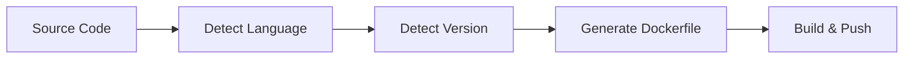

migetpacks builds your application in four phases. Each phase is handled by a dedicated script inside the builder container.



## Phase 1: Language Detection

The `bin/detect` script scans your source directory for language-specific marker files. It checks each language in priority order and returns the first match.

<Tabs>
  <Tab title="Detection Rules">
    | File Present | Detected Language |
    |-------------|-------------------|
    | `Dockerfile` | dockerfile |
    | `compose.yaml` / `docker-compose.yml` | compose |
    | `Gemfile` | ruby |
    | `package.json` | nodejs |
    | `deno.json` / `deno.jsonc` | deno |
    | `bun.lockb` / `bunfig.toml` | bun |
    | `requirements.txt` / `pyproject.toml` / `setup.py` | python |
    | `go.mod` | go |
    | `Cargo.toml` | rust |
    | `pom.xml` / `build.gradle` | java |
    | `build.gradle.kts` | kotlin |
    | `build.sbt` | scala |
    | `project.clj` | clojure |
    | `*.csproj` / `*.sln` / `*.slnx` | dotnet |
    | `mix.exs` | elixir |
    | `composer.json` | php |
  </Tab>
  <Tab title="Override">
    Skip auto-detection by setting the `LANGUAGE` environment variable:

    ```bash
    -e LANGUAGE=ruby
    ```

    This is useful for polyglot repos where multiple marker files exist.
  </Tab>
</Tabs>

<Info>
  If a `Dockerfile` is present, migetpacks uses it directly instead of generating one. Set `LANGUAGE` explicitly to override this behavior.
</Info>

## Phase 2: Version Detection

The `bin/detect-version` script reads language-specific version files and normalizes them for Docker image tags.

<Tabs>
  <Tab title="Version Sources">
    | Language | Version Sources (priority order) |
    |----------|----------------------------------|
    | Node.js | `.node-version` → `.nvmrc` → `package.json` engines.node |
    | Ruby | `.ruby-version` → `Gemfile` ruby declaration |
    | Python | `.python-version` → `runtime.txt` → `uv.lock` → `pyproject.toml` |
    | Go | `.go-version` → `go.mod` go directive |
    | Rust | `rust-toolchain` → `rust-toolchain.toml` channel |
    | Java | `.java-version` → `system.properties` → `pom.xml` |
    | .NET | `global.json` → `*.csproj` TargetFramework |
    | Elixir | `.elixir-version` → `.tool-versions` (asdf) |
    | Deno | `.deno-version` → `.dvmrc` → `deno.json` version |
    | Bun | `.bun-version` → `bunfig.toml` version |
    | PHP | `.php-version` → `composer.json` require.php |
  </Tab>
  <Tab title="Normalization">
    Versions are normalized for Docker tag compatibility:

    ```text
    20.x                → 20
    >=18.0.0            → 18.0
    ^3.2.0              → 3.2
    20.x || 22.x        → 22
    3.12.8              → 3.12.8 (kept as-is)
    ```

    The goal is to match available Docker Hub image tags while respecting the developer's version constraint.
  </Tab>
</Tabs>

## Phase 3: Dockerfile Generation

The `bin/build` script generates an optimized multi-stage Dockerfile using the detected language and version. The generated Dockerfile follows best practices for layer caching.

### Example: Node.js Application

For a Node.js app with version `20` detected from `.nvmrc`, migetpacks generates:

```dockerfile
# Stage 1: Builder
FROM node:20 AS builder
WORKDIR /build

# Dependencies first (cached when lockfile unchanged)
COPY package.json package-lock.json ./
RUN npm ci

# Source code (changes frequently)
COPY . .
RUN npm run build && npm prune --production

# Cleanup dev/test files
RUN rm -rf .git .github test tests spec __tests__ coverage .nyc_output .cache

# Stage 2: Runtime (minimal image)
FROM node:20-slim
RUN groupadd -g 1000 miget && useradd -u 1000 -g miget -m miget
WORKDIR /app

COPY --from=builder --chown=miget:miget /build .

USER miget
EXPOSE 5000
CMD ["node", "server.js"]
```

### Layer Caching Strategy

The key optimization is separating dependency installation from source code copying:

```text
Step 1: COPY lockfiles     → Changes rarely     → CACHED
Step 2: RUN install deps   → Depends on Step 1  → CACHED (if lockfiles unchanged)
Step 3: COPY source code   → Changes frequently → Rebuilt
Step 4: RUN build + prune  → Depends on Step 3  → Rebuilt
```

This means that when only your source code changes (the common case), dependency installation is skipped entirely.

### Custom Environment Variables

Any environment variable not in the known builder vars list is automatically injected into the generated Dockerfile:

```bash
# Pass build-time env vars
docker run --rm \
  -v ./app:/workspace/source \
  -v /var/run/docker.sock:/var/run/docker.sock \
  -e OUTPUT_IMAGE=my-app:local \
  -e NODE_OPTIONS="--max-old-space-size=4096" \
  -e NEXT_PUBLIC_API_URL="https://api.example.com" \
  miget/migetpacks:latest
```

These become `ENV` statements in the generated Dockerfile, available at both build time and runtime.

## Phase 4: Build and Push

The final phase uses Docker-in-Docker with BuildKit to build and push the image.

<Steps>
  <Step title="Start Docker daemon">
    A Docker-in-Docker daemon starts inside the builder container with BuildKit enabled.
  </Step>
  <Step title="Configure registry access">
    Registry credentials and mirrors are configured in the daemon. If `REGISTRY_MIRROR` is set, it is added as a pull-through cache.
  </Step>
  <Step title="Build with BuildKit">
    The generated Dockerfile is built with `docker buildx build`. Cache is read from and written to `CACHE_IMAGE` if configured.
  </Step>
  <Step title="Push or load">
    If `OUTPUT_IMAGE` contains a registry prefix, the image is pushed. Otherwise, it is loaded into the local Docker daemon.
  </Step>
  <Step title="Write results">
    If `RESULT_FILE` is set, build metadata (status, ports, processes, timing) is written as JSON for downstream CI/CD steps.
  </Step>
</Steps>

### Build Cache Options

<CodeGroup>

```bash Registry Cache
docker run --rm \
  -v ./app:/workspace/source \
  -v /var/run/docker.sock:/var/run/docker.sock \
  -e OUTPUT_IMAGE=registry.io/my-app:latest \
  -e CACHE_IMAGE=registry.io/my-app:cache \
  miget/migetpacks:latest
```

```bash Shared Package Cache
docker run --rm \
  -v ./app:/workspace/source \
  -v /var/run/docker.sock:/var/run/docker.sock \
  -v /tmp/build-cache:/cache \
  -e OUTPUT_IMAGE=my-app:local \
  -e BUILD_CACHE_DIR=/cache \
  miget/migetpacks:latest
```

```bash No Cache (Fresh Build)
docker run --rm \
  -v ./app:/workspace/source \
  -v /var/run/docker.sock:/var/run/docker.sock \
  -e OUTPUT_IMAGE=my-app:local \
  -e NO_CACHE=true \
  miget/migetpacks:latest
```

</CodeGroup>

## Runtime Container

The built container follows these conventions:

| Property | Value |
|----------|-------|
| User | `miget` (uid 1000) |
| Working directory | `/app` |
| Default port | `5000` |
| Process manager | None (single process) |
| Init system | None (PID 1 is your app) |

When `USE_DHI=true`, the runtime container is distroless (no shell, no package manager) and runs as the `nonroot` user instead.

## Next Steps

<CardGroup cols={2}>
  <Card title="Environment Variables" icon="sliders" href="/configuration/environment-variables">
    Full reference for all builder configuration options.
  </Card>
  <Card title="Build Caching" icon="database" href="/guides/build-caching">
    Optimize build times with registry and shared caches.
  </Card>
  <Card title="Multi-Buildpack" icon="layer-group" href="/guides/multi-buildpack">
    Combine multiple languages in a single build.
  </Card>
  <Card title="Hardened Images" icon="shield-halved" href="/guides/hardened-images">
    Use Docker Hardened Images for production.
  </Card>
</CardGroup>
